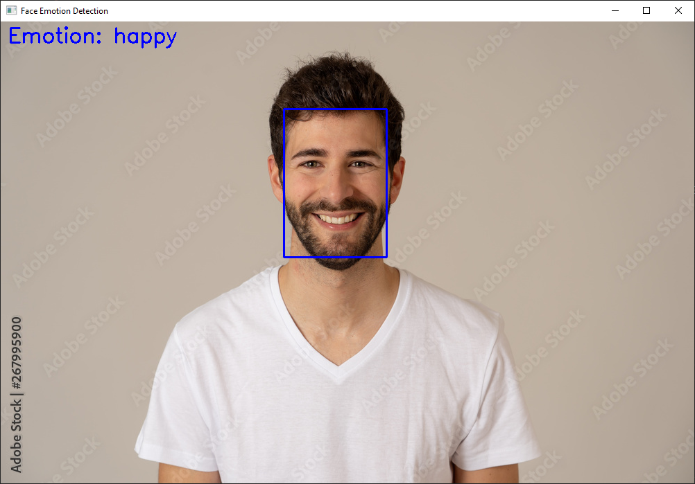

# Face Emotion Detection with Vision Transformer & MTCNN

A simple project for **emotion detection** using:

- [MTCNN](https://github.com/timesler/facenet-pytorch) for face detection  
- [ViT (Vision Transformer)](https://huggingface.co/trpakov/vit-face-expression) for facial expression classification  

---

## Overview

This project detects faces in images or video streams and predicts the **dominant emotion** (e.g., happy, sad, angry, surprised).  
The model is based on a **pre-trained Vision Transformer** fine-tuned for facial expressions.  

Pipeline:

1. Read a image.  
2. Detect face bounding boxes using **MTCNN**.  
3. Crop the face region.  
4. Extract features with Hugging Face’s **AutoFeatureExtractor**.  
5. Classify emotion using **AutoModelForImageClassification**.  
6. Display the result with bounding boxes and predicted emotion.  

---

## Usage

### 1. Clone this repository

```bash
git clone https://github.com/omidNomiri/face_emotion_tracker.git
cd face-emotion-detection
````

### 2. Install dependencies

```bash
pip install -r requirements.txt
```

### 4. Run on a video file

write your image path in input of function after that run below command:

```bash
python main.py
```

---

## Ideas for Improvement

- Add **multi-face emotion detection** in a single frame.
- Optimize for **real-time performance** (ONNX / TensorRT).
- Create a **Streamlit / Gradio web app** for easier demo.
- Train or fine-tune on a **custom dataset**.
- Add logging & analytics (save results to CSV/JSON).

---

## Example

### Input

set image path of a person showing anger:

```python
process_video("image_path")
```

### Output

The program will display:

- A bounding box around the detected face.
- The predicted emotion printed on screen and console.

```cmd
17:05:46: happy
```



---

## Dependencies

Install dependencies with blew command:

```bash
pip install -r requirements.txt
```

## License

MIT License – feel free to use this project for learning, research, or personal projects. Contributions welcome!